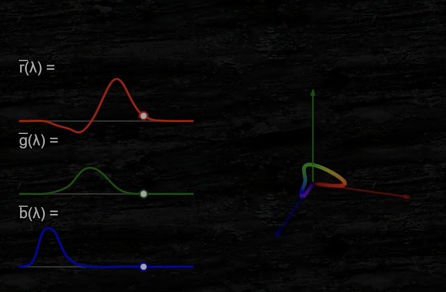
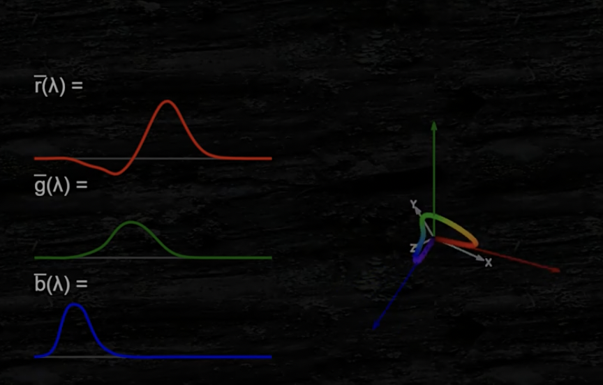
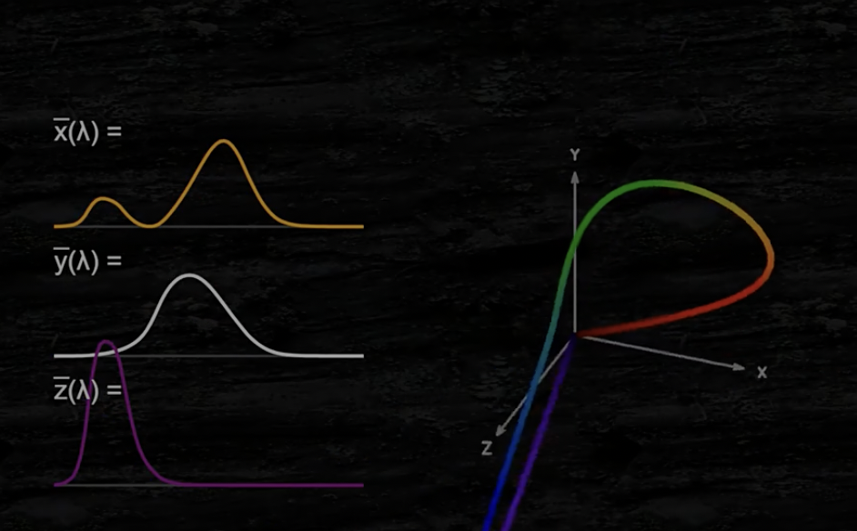
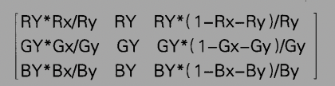

# 5.1 像素

像素储存于帧缓冲（frame buffer）= ColorBuffer+DeptBuffer+StencilBuffer， 本质上就是一段缓存，通常就是显存上的一段内存，其直接与最终显示到终端上的内容对应，所有需要显示到终端上的图形内容都必须拷贝到Framebuffer中。

FBO(Frame Buffer Object)定义上述三者的attr。描述属性的状态，例如颜⾊、深度和模板缓存区的大小和格式。

- 内存：随机存取存储器 RAM（Random Access Memory）是与 CPU 直接交换数据的内部存储器。
- 显存（VRAM）：帧缓存

通常Framebuffer中有前端和后端两类buffer，就是我们平常见到的double buffer技术，目的是为了解决[屏幕撕裂（screen tear）](https://github.com/spatulaG/CG-Study-Notes/blob/main/Content/%E6%B8%B8%E6%88%8F%E5%BC%95%E6%93%8E%E5%9F%BA%E7%A1%80vol2-%E6%B8%B2%E6%9F%93/Content/misc/Readme.md#screen-tear)问题。 前端buffer直接对应于欲显示的内容，需要显示的数据先拷贝到后端buffer，再在一定的时机(比如vblank)将后端buffer的数据swap到前端，从而显示出来。

# 5.2 色彩科学


## 视网膜包含两种细胞
- 视锥细胞： 对R(600nm)G(550)B(450)三个颜色敏感， 也是SML波长
- 视杆细胞： 对黑白敏感

可见光：400-750nm

CIE的等色匹配实验为了找到primary（三元光）和复色的配比得到了这张图：


确定了RGB分别是 700，546.1和435.8//RGB
但450-550范围内的长光需要负值的红光才能匹配到，但是光只能加不能减。

### color matching functions

消灭R负值， 于是提出CIE XYZ， 三个想象出来的光。



R轴有负数



找到XYZ



变换成垂直坐标系。

但因为我们只想讨论颜色不想讨论亮度，所以把这个三维空间投影到了X+Y+Z=1的平面
成为CIE 1931 xyz color space舌形图
或者把z也丢掉只用XY表示色度

色域：gamut

# 颜色空间

颜色空间需要具备的三个条件：三原色，白点，传递函数
三原色可能在不同颜色空间对应不同的XY，白点是rgb是1时的XY位置（sRGB颜色空间的白点D65的位置如下（xy坐标为(0.31271, 0.32902)））
白点定义了这个RGB颜色空间中纯白色 (1, 1, 1)在色度图上的位置

利用三原色在色度图里的xy坐标可以它们在XYZ坐标空间中的向量方向，为了方便计算我们可以只考虑它们的单位向量方向记为(Rx, Ry, Rz)、(Gx, Gy, Gz)和(Bx, By, Bz)。通过缩放并叠加这三个单位向量方向我们可以得到这个颜色空间的任意一点的空间位置，即P = (Rx, Ry, Rz) * r + (Gx, Gy, Gz) * g + (Bx, By, Bz) * b，其中r、g、b分别表示三个向量的缩放大小。

那么，我们可以找到一组(r, g, b)系数使得P = 白点位置。也就是说，通过这个白点我们可以定义三原色向量的相对长度关系

白点实际上是RGB是1时在X+Y+Z=1平面上的投影，我们可以等比例放缩rgb，来得到白点所在的白色射线。
其中，当Y=1时， 亮度为最大是色彩的上限。

## 白点的推算思路：

首先x = X/X+Y+Z, y = Y/X+Y+Z, z = Z/X+Y+Z. x+y+z = 1.

- xyz:色坐标（投影到X + Y + Z = 1的平面上。这个二维色度空间（chromaticity color space）就被称为CIE 1931 xyz color space）
- XYZ：三刺激值

给出RY，GY，BY就可以算出RGB三刺激值



而白色坐标就是
- WX = RX+GX+BX
- WY...
- WZ...

然后给出白色的色坐标和亮度值也可以反推RGB三原色亮度。

- 然而我之前一直以为白点就是这么算出来的后来发现怎么算怎么不对， 原来我们不取1：1：1。

• 等量的三色
```c++
IEE(λ) = 1
(xEE, yEE, zEE) = (1/3, 1/3, 1/3)
```

• D65 光照 (PAL):
```c++
I65(λ) = Natural Sun Light
(x65, y65, z65) = (0.3127, 0.3290, 0.3583)
```

• C 光照 (NTSC):
```c++
Ic(λ) = not defined
(xc, yc, zc) = (0.310, 0.316, 0.374)
```

```c++
// 我们需要求解新的RGB颜色空间（sRGB）的三原色在XYZ颜色空间的索引值：
Rxyz = (Rx, Ry, Rz)
Gxyz = (Gx, Gy, Gz)
Bxyz = (Bx, By, Bz)

// 通过色度图中的三原色和白点坐标，我们可知：
Rxyz = (0.64, 0.33, 0.03) * r
Gxyz = (0.30, 0.60, 0.10) * g
Bxyz = (0.15, 0.06, 0.79) * b

// 白点在XYZ颜色空间的索引值为
Wxyz = (Wx, 1, Wz)
     = (0.31271, 0.32902, 0.35827) * w
     = |Rx Gx Bx| |1|
       |Ry Gy By| |1|
       |Rz Gz Bz| |1|

// 那么有：
w = 3.03933
Wxyz = (0.95043, 1, 1.08890)

// 结合两者有：
0.64r + 0.30g + 0.15b = 0.95043
0.33r + 0.60g + 0.06b = 1
0.03r + 0.10g + 0.79b = 1.08890

// 求解可得：
r = 0.644463125
g = 1.191920333
b = 1.202916667

// 那么sRGB颜色空间的三原色在XYZ颜色空间的索引值为：
Rxyz = (0.4124564, 0.2126729, 0.0193339)
Gxyz = (0.3575761, 0.7151522, 0.1191920)
Bxyz = (0.1804375, 0.0721750, 0.9503041)
```
## 光的色温：
根据黑体温度来定义白点温度, D65约为6500开。

## tonemapping：

亮度的单位是:一根蜡烛/平方米表面(cd/m2)
将HDR映射到可以显示的亮度空间SDR（Standard Dynamic Range）叫做tone mapping
两种SDR标准一个是sRGB(gamma2.2)一个是Rec.709(gamma2.0)

sRGB和Rec. 709的三原色和白点值是完全相同的，这意味着它们和CIE 1931 XYZ颜色空间的变换矩阵是完全相同的，而它们的不同点在于传递函数。
sRGB标准假定的观察环境是照明条件良好的办公环境，也就是PC常见的应用场景。而Rec. 709标准的观察环境是用于家庭影院这种更为昏暗的照明环境的
为了解决伽马校正后过曝的情况， Tonemapping进化到现在，基本上已稳定成使用一条S曲线来控制各个区域（shadow、midtone、highlight）的表现，使得曲线中间部分的对比度被提高而两端部分的对比度则被降低。

在ACES Filmic Tonemapping曲线里，亮度为1的值被重新映射到0.86左右，也就是说原场景中超过1的高亮部位被重新映射到0.86~1的范围内了。这使得最终的渲染画面可以保留更多的光照细节和对比度，画面也更为鲜艳。

## 总结步骤
1. 首先以sRGB线性颜色值在Scene Referred颜色空间下渲染出HDR, 后处理
2. 使用曝光（亮度缩放）和tonemapping（曲线映射到0-1范围）把场景亮度重新映射到一个可供显示的区间范围
3. 使用sRGB OETF传递函数对数据进行编码，转换到Display Referred颜色空间sRGB gamma space
4. 在sRGB gamma空间里进行后续SDR后处理计算、Color Grading、AA和UI渲染等操作
5. SDR显示器应用EOTF将编码后的display referred image信号值最终转换成显示屏发光亮度值

### 游戏引擎需要做的过程可以简化如下：

- 对sRGB颜色贴图进行sRGB EOTF解码
- 在线性渲染空间下进行场景渲染
- 利用类似LinearTosRGB的函数对最后输出进行sRGB EOTF编码并发送给显示器

## HDR和ACES
SDR最明显的缺点就是它覆盖的色域范围太小，只占了CIE 1931颜色空间的大约35.9%区域
Rec. 2020定义了一个HDR颜色空间的三原色（R (0.708, 0.292), G (0.170, 0.797), B (0.131, 0.046)）和白点（D65），它的色域范围可覆盖CIE 1931颜色空间的75.8%。

### Barten Ramp模型
它描述了在当前亮度值（横坐标）下，两个亮度值之间的差别达到多大百分比时可以被人眼所察觉到。亮度差处于虚线上方时，人眼就可以察觉到亮度对比从而出现所谓的banding现象；当亮度差处于虚线下面时，在人眼看来它们就是没有区别的是平滑渐变的


Dolby提出的PQ传递函数在12位精度下所得到的亮度差曲线，可见PQ传递函数的编码方式在各个亮度区间范围内都可以更加充分地利用编码数据.

PQ传递函数输出的是一个范围在0到10000 cd/m²的绝对亮度值，而SDR输出的则是一个在0到1范围内的相对亮度值，SDR显示器显示的真正亮度值是未知的。这种确定性在我们debug时也很有帮助，例如PQ值为0.5时对应的亮度值大约为100尼特，它是老的LCD显示器常见的亮度峰值；PQ为0.75时对应的亮度值大约为1000尼特，它是一部分HDR TV显示器的亮度峰值。

很多游戏引擎在HDR显示时都会先使用PQ传递函数把场景线性亮度值转换成0到1的编码值并以此来采样一张[3D LUT](https://github.com/spatulaG/CG-Study-Notes/blob/main/Content/%E6%B8%B8%E6%88%8F%E5%BC%95%E6%93%8E%E5%9F%BA%E7%A1%80vol2-%E6%B8%B2%E6%9F%93/Content/misc/Readme.md#lut)做Color Grading和Tonemapping的操作。例如，UE4在为HDR显示计算3D LUT时会使用ST2084ToLinear进行解码来得到线性亮度值，并在此亮度值上做后续的颜色操作
```c++
// Since ST2084 returns linear values in nits, divide by a scale factor to convert 
// the reference nit result to be 1.0 in linear. 
// (for efficiency multiply by precomputed inverse) 
LinearColor = ST2084ToLinear(LUTEncodedColor) * LinearToNitsScaleInverse;
```
在采样这张3D LUT时，会进行上述计算的反函数来把线性亮度值转换成0到1的纹理采样坐标：
```c++
// ST2084 expects to receive linear values 0-10000 in nits. 
// So the linear value must be multiplied by a scale factor to convert to nits. 
float3 LUTEncodedColor = LinearToST2084(LinearColor * LinearToNitsScale);  

float3 UVW = LUTEncodedColor * ((LUTSize - 1) / LUTSize) + (0.5f / LUTSize); 
float3 OutDeviceColor = Texture3DSample( ColorGradingLUT, ColorGradingLUTSampler, UVW ).rgb; 
```
上述PQ传递函数需要两次pow计算和一次rcp计算，在计算时要小心它的指令消耗：
```c++
// Dolby PQ transforms 
// 
float3 ST2084ToLinear(float3 pq) 
{
     const float m1 = 0.1593017578125; // = 2610. / 4096. * .25;
     const float m2 = 78.84375; // = 2523. / 4096. *  128;
     const float c1 = 0.8359375; // = 2392. / 4096. * 32 - 2413./4096.*32 + 1;
     const float c2 = 18.8515625; // = 2413. / 4096. * 32;
     const float c3 = 18.6875; // = 2392. / 4096. * 32;
     const float C = 10000.;
     float3 Np = pow( pq, 1./m2 );
     float3 L = Np - c1;
     L = max(0., L);
     L = L / (c2 - c3 * Np);
     L = pow( L, 1./m1 );
     float3 P = L * C;

     return P;
} 
```

这种线性到线性的对应关系并不满足视觉上的线性关系，这会造成高亮和较暗区域都缺少细节。因此，我们仍然需要某种Tonemapping操作来把我们场景里高动态亮度值重新映射到显示设备可支持的亮度范围内，在这个映射过程中可以适当提高高亮和阴影区域的对比度来得到更好的视觉效果。ACES中就提供了几种最常见也是最通用的HDR曲线映射（View Transform），它们被分别用于1000 cd/m²、2000 cd/m²和4000 cd/m²标准的HDR显示。这些映射函数的设计初衷是为了让HDR显示可以得到和SDR显示在视觉上尽可能一致的画面效果。在后面讲到ACES时我们会具体看到这些映射函数。

## 评价
我们一般认为使用光谱渲染器（例如Mitsuba，使用波长进行颜色计算）得到的结果是ground truth。用gt来做差值颜色越暗表示差值越小也就意味着结果更接近ground truth更正确。

目前，在各个软件里使用ACES工作流最方便的途径就是使用OpenColorIO。OpenColorIO是一个Sony Pictures Imageworks开发的开源颜色管理系统。诸如Nuke、Fusion、Maya等软件都已支持OpenColorIO，我们可以使用OCIO配置文件来进行色彩管理，最新的ACES OCIO文件可以在github上下载，这些配置文件可以帮助我们对图像做各种ACES颜色转换。

## ACES 词典
使用LUT实现ACES（Academy Color Encoding System）会涉及到的：
- IDT（Input Device Transform）：把拍摄的图像素材和内容变换为ACES颜色空间和编码规范的过程。
- RRT（Reference Rendering Transform）：因为ACES标准的范围很大，甚至可以显示ACES色彩的显示设备还没有出现，所以我们需要通过RRT通过色彩映射把颜色显示在我们的监看设备
- ODT（Output Device Transform）：根据我们的监视看环境和最终输出要求将ACES转换为我们的目标色彩，比如DCI-P3、REC.709、sRGB等。简单来说，ODT就是输出设备转换器。
- LMT：一个由用户定义的LUT转换阶段，定基调


- SSTS(Single Stage Tone Scale): 使用一个统一的算法替代(RRT+ODT)。
- ACEScg：使用线性转换函数编码的scene-referred颜色空间，它主要用于CG、VFX和合成阶段
- AP0和AP1三原色的值是一大批专家们为了它们的应用场景而严格设计和定义的。AP0的三个顶点所围成的区域包含了整个光谱轨迹, AP1只有G稍微出格。
- Rec. 709是基于国际电信联盟无线电通信部门 BT.709 制定的高清电视（HDTV - HD）的色彩标准。色彩空间与 sRBG 相差无几，也就是我们常说的 sRGB 覆盖 Rec.709 色彩空间。覆盖就是大于此色彩空间，并覆盖。从大到小：Rec.2020＞ DCI-P3 ＞ sRGB ≈ Rec.709。


# 5.4 世界坐标
转换世界坐标时，W（当前node）= W（上层node）* M（本层）

### 坐标转换时经过六个步骤

- 物体坐标object space
- (世界坐标world space)
- 相机坐标camera space
- 裁切坐标clip space
- 设备坐标device space
- 视口坐标viewport space

从模型坐标---Mobj--世界坐标----(Mcamera^(-1))---相机坐标

<--------------------------MVP------------------------->

其中相机的坐标可以想象成把相机归位到视口，所以这里取相机世界坐标的逆矩阵。

MVP变换的目的是把XYZ分别投射到一个长宽-w~w深度-~w的长方空间内，然后在device space中除去w变成一个2x2x1的范围

# 5.5 渲染管线
这里重点说Hull Shader 和 Domain Shader。注意如果要开启tessellation就要同时开启HS和DS， 并且一旦开启vertex shader的输出就不再是tri而是patch单位的control points了。

## 5.5.1 几何处理 Geometry Processing

### Hull Shader

又叫曲面细分shader。包含下面这些属性

- domain的patch三种：tri, quad, isoline
- 分割类型（partitioning）三种：integer, fractional_even, fractional_odd。前者是突变，后两者是在偶数（奇数）是由两边端点向内展开
- output topo三种，逆时针顺时针和线段
- output control points对应domain shader的output patch
- maxTess Factor：细分度（最大64）
- Patch constant Func

HS包含的参数蛋Input Patch（来自VS）， point ID和prim ID。

细分有两种：
- SV_TessFactor：每个边的分割设定（可以每个边不同）
- SV_InsideTessFactor：内部的细分设定（将面的长和宽分成多少段）

### Domain Shader
DS可以直接到FS也可以经过Geometry Shader。GS在粒子系统里可以把输入的点集变成一个个小billboard。而VS可以传入Framebuffer颜色、深度和模板缓冲信息。

参数包含：
- PatchTess 细分参数来自const HS
- Domain Location顶点位置信息
- Output Patch

GPU在得到来自VS的点集之后会用vertex array来生成三角形避免重复点。已经经过VS变换的点会被存放在post-transform cache里被随时调用。一个vertex的信息所占据的全部内存被叫做一个跨步（stride）。一般颜色可能RGBA各占8bit，normal和tangent因为Z可以由XY计算所以一般各占16bit。几何处理的最后要进行世界坐标转换。 一般由VS，GS或DS处理。
MVP.xyz代表xyz世界单位向量，w代表世界坐标。

## 5.5.2 片元处理 Fragment Shader

Clipping裁切包含 scissor test, 用于discard 视口之外，guard band（+- bWclip）之内的区域。而保护渲染区外的内容会被clip掉。
backface culling则是由三角形各点顺时针逆时针判断的。 

在运行FS的时候我们把像素格拆分成一个个2x2的像素块（为了解决mipmap的问题【TODO】）。计算导数时就Yup-Ybottom, Xright-Xleft。因此每个边缘的2x2块由于三角形共享边会被运行两次， 优化时要格外小心使用复杂FS的大量的小三角形。想post这种全屏幕效果一般就直接整个视口用一个三角形。

栅格化时三角形内部的点使用barycentric coordinate，也就是按照每个顶点的权重（0-1）定义的坐标系。栅格化同时还要考虑AA。传统的SSAA很浪费，优化后的MSAA绕着目标点取rotate grid的四个像素格取平均。这样做的弊端是要额外占用4倍mem。

## 5.5.3 帧缓存 Frame Buffer
- Depth Test
- Stencil Test
- Depth Bound Test

并且deferred shader还可以利用early Z来提早丢掉像素点。由于透视空间的Z非线性，现在通常会把近处设为1远为0.这是因为GPU硬件在存储浮点的时候精度也是非线性（尾数^指数）越接近0变化越大，这样和Z精度几乎一致，精度的衰减就没那么明显了。

24bit的depth以外剩下8bit是stencil，用于一些用户自定义的判断。而depth bound则是把深度也按W clip一次。

## 课后练习答案
### 计算内存
32(64)bit：4(8)byte * 1280 * 720


### 推导3x3 sRGB和CIE的转换矩阵


## 引用：

[具体实验参考](https://medium.com/hipster-color-science/a-beginners-guide-to-colorimetry-401f1830b65a)

[COD ppt](https://research.activision.com/publications/archives/hdr-in-call-of-duty)

[HDR for CG artists](https://chrisbrejon.com/cg-cinematography/)

[wiki](https://en.wikipedia.org/wiki/RGB_color_spaces)

[ACES](https://github.com/ampas/aces-dev/tree/master)

[Lele Feng](https://www.zhihu.com/people/lele-feng-15/posts)
