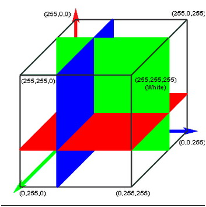

# 补充内容

## LUT

一种转换模型。传统的1D LUT变动某个颜色输入值只会影响到该颜色的输出值，RGB的数据之间是互相独立的。
1D LUTs只能控制gamma值、RGB平衡（灰阶）和白点（white point）。

为了克服1D LUT的限制，我们可以对其应用一个3×3的矩阵来控制颜色饱和度和亮度，在完整的色彩空间中进行线性缩放。但更好的办法是3D LUT。



```
//check the point in pos
bool checkPointInRect(uint2 point,uint2 origin, uint2 rect){
    return point.x >= origin.x &&
    point.y >= origin.y &&
    point.x <= (origin.x + rect.x) &&
    point.y <= (origin.y + rect.y);
}
kernel void image_filiter(constant ImageSaturationParams *params [[buffer(0)]],
                          texture2d<half, access::sample> sourceTexture [[texture(0)]],
                          texture2d<half, access::write> targetTexture [[texture(1)]],
                          texture2d<half, access::sample> lutTexture [[texture(2)]],
                          sampler samp [[sampler(0)]],
                          uint2 gridPos [[thread_position_in_grid]]){

    
    float2 sourceCoord = float2(gridPos);
    half4 color = sourceTexture.sample(samp,sourceCoord);
    
    
    float blueColor = color.b * 63.0;
    
    int2 quad1;
    quad1.y = floor(floor(blueColor) / 8.0);
    quad1.x = floor(blueColor) - (quad1.y * 8.0);
    
    int2 quad2;
    //取邻近的两个方块
    quad2.y = floor(ceil(blueColor) / 8.0); 
    quad2.x = ceil(blueColor) - (quad2.y * 8.0);
    
    half2 texPos1;
    texPos1.x = (quad1.x * 0.125) + 0.5/512.0 + ((0.125 - 1.0/512.0) * color.r); //0-63，所以要减去1/512， 0.5/512取中央位置
    texPos1.y = (quad1.y * 0.125) + 0.5/512.0 + ((0.125 - 1.0/512.0) * color.g);
    
    half2 texPos2;
    texPos2.x = (quad2.x * 0.125) + 0.5/512.0 + ((0.125 - 1.0/512.0) * color.r);
    texPos2.y = (quad2.y * 0.125) + 0.5/512.0 + ((0.125 - 1.0/512.0) * color.g);
    
    
    half4 newColor1 = lutTexture.sample(samp,float2(texPos1.x * 512 ,texPos2.y * 512));
    half4 newColor2 = lutTexture.sample(samp,float2(texPos2.x * 512 ,texPos2.y * 512 ));
  
    half4 newColor = mix(newColor1, newColor2, half(fract(blueColor)));
    
    
    half4 finalColor = mix(color, half4(newColor.rgb, color.w), half(params->saturation));
    
 
    uint2 destCoords = gridPos + params->clipOrigin;
    
    
    uint2 transformCoords = destCoords;
    
    //transform coords for y
    if (params->changeCoord){
        transformCoords = uint2(destCoords.x, sourceTexture.get_height() - destCoords.y);
    }
    //transform color for r&b
    half4 realColor = finalColor;
    if (params->changeColor){
        realColor = half4(finalColor.bgra);
    }
    
    if(checkPointInRect(transformCoords,params->clipOrigin,params->clipSize))
    {
        targetTexture.write(realColor, transformCoords);
        
    }else{
        
        targetTexture.write(color,transformCoords);
    }
}
```

[来源](https://programmer.ink/think/metal-series-of-tutorials-2-metal-implementation-of-lut-filters.html)
举例说明的话就是：
- 首先决定哪个蓝色方块，比如 b = 0.2 * 63 = 12.6那就是（4，1）
- 然后决定R和G的坐标， r = 0.4 * 63 = 25.6, g = 0.6 * 63 = 37.8。那么在一个8 * 64 = 512的阵列中，坐标是(4 * 64 + 25.6, 1 * 64 + 37.8)
- 但因为LUT存储是离散的所以我们要去掉浮点((4 * 64 + 25.6)/512, (1 * 64 + 37.8)/512)//最终转换到(0,1)区间
- 至于b我们取ceil临近格来插值

## Screen Tear

高帧数游戏用低帧显示器就会出现screen tear：显示器把多帧显示到屏幕上。

Vsync: 垂直同步。控制屏幕更新率与显卡相同，进而大幅减少画面撕裂，让画面更顺畅。

