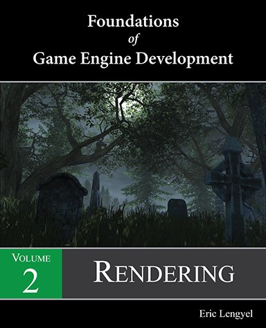

# 目录
 

 

## 第五章 : 图像处理

5.1 像素

5.2 色彩科学

  5.2.1 CIE RGB 色彩空间

  5.2.2 CIE XYZ 色彩空间

  5.2.3 sRGB 色彩空间

5.3 伽玛矫正

5.4 世界结构

- 5.4.1 坐标系
  
- 5.4.2 变换层级
  
- 5.4.3 顶点变换
  
5.5 图形管线

- 5.5.1 几何处理

- 5.5.2 像素处理

- 5.5.3 帧缓存运算

Exercises for Chapter 5

 

## 第六章: 投影

6.1 视锥

6.2 透视差值

6.3 投影矩阵

- 6.3.1 透视投影矩阵

- 6.3.2 无穷远投影矩阵

- 6.3.3 投影深度精度

- 6.3.4 正交投影

- 6.3.5 视锥切面

6.4 自定义切面

Exercises for Chapter 6

 

## 第七章 : 着色器

7.1 渲染基础

- 7.1.1 流明（亮度）

- 7.1.2 渲染方程

7.2 漫反射

7.3 高光反射

7.4 贴图

- 7.4.1 贴图坐标

- 7.4.2 传统贴图

- 7.4.3 立方体贴图

7.5 切线空间

7.6 凹凸贴图

- 7.6.1 法线贴图

- 7.6.2 法线渲染

- 7.6.3 法线混合

7.7 视差贴图

7.8 水平贴图

- 7.8.1 水平贴图构成

- 7.8.2 水平贴图渲染

- 7.8.3 环境光遮罩

Exercises for Chapter 7

## 第八章 : 光与影

8.1 光源

- 8.1.1 点光源

- 8.1.2 聚光灯

- 8.1.3 平行光

8.2 优化

- 8.2.1 视口裁切

- 8.2.2 深度区间

8.3 阴影贴图

- 8.3.1 2D 阴影贴图

- 8.3.2 立方体阴影贴图

- 8.3.3 级联阴影贴图

- 8.3.4 阴影深度位移

8.4 模版阴影

8.4.1 渲染算法

8.4.2 Variant Selection

8.4.3 体积阴影？

8.4.4 优化

8.5 雾

8.5.1 光的吸收和散射

8.5.2 Halfspace Fog

Exercises for Chapter 8

## 第九章 : 可见度和遮罩

9.1 几何裁切

9.2 立体几何裁切

9.3 包围体

- 9.3.1 Bounding Spheres

- 9.3.2 Bounding Boxes

9.4 视椎裁切

- 9.4.1 可见范围

- 9.4.2 Sphere Visibility

- 9.4.3 Box Visibility

9.5 Light Culling

9.6 Shadow Culling

9.7 Portal Systems

- 9.7.1 Zones and Portals

- 9.7.2 Light Regions

9.8 Occluders

9.9 Fog Occlusion

Exercises for Chapter 9

## 第十章 : 渲染进阶

10.1 贴花

10.2 广告牌

- 10.2.1 Spherical Billboards

- 10.2.2 Cylindrical Billboards

- 10.2.3 Polyboards

- 10.2.4 剪裁

10.3 The Structure Buffer

10.4 体积渲染

- 10.4.1 光环

- 10.4.2 光轴渲染？

10.5 环境遮罩

- 10.5.1 遮罩缓存

- 10.5.2 深度模糊

10.6 环境阴影

- 10.6.1 环境光缓存

- 10.6.2 Sample Randomization

- 10.6.3 各向异性散射

- 10.6.4 实现

10.7 运动模糊

- 10.7.1 速度缓存

- 10.7.2 图像处理

10.8 等值面提取

- 10.8.1 立方体步进算法

- 10.8.2 Preferred Polarity

- 10.8.3 实现

Exercises for Chapter 10

//不知道的或者太显而易见的我就不翻译了
